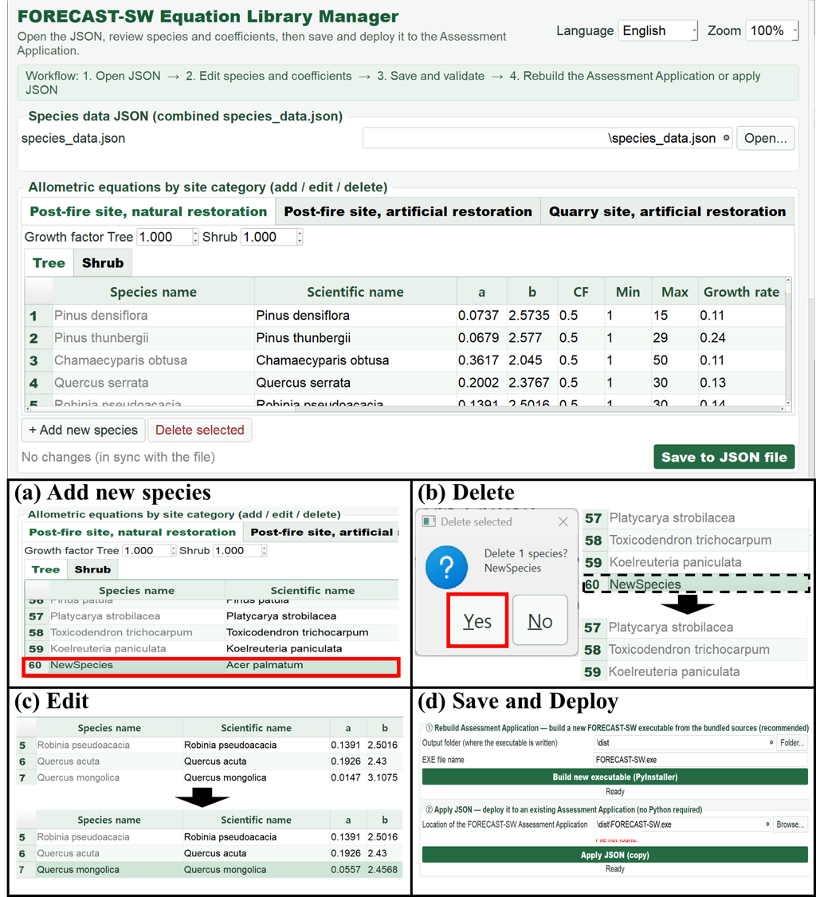
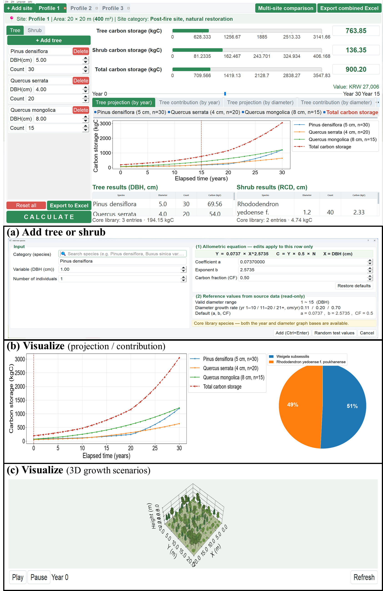
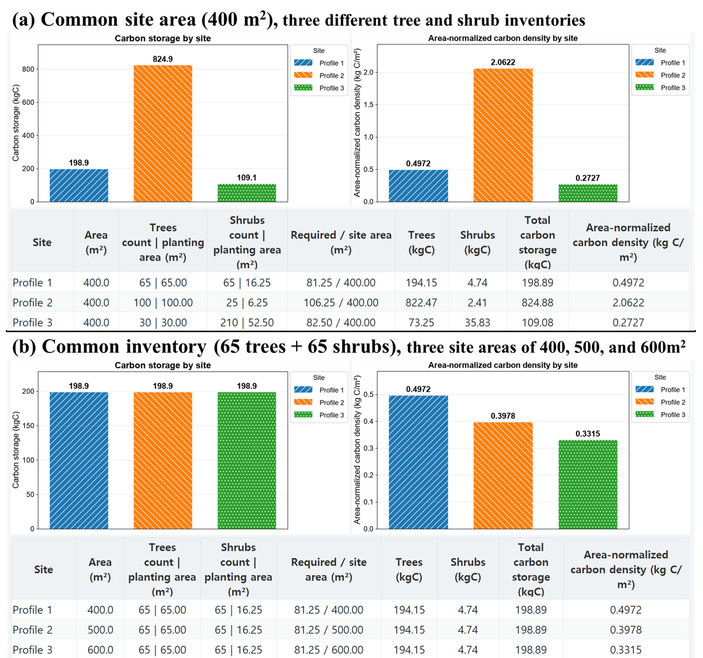
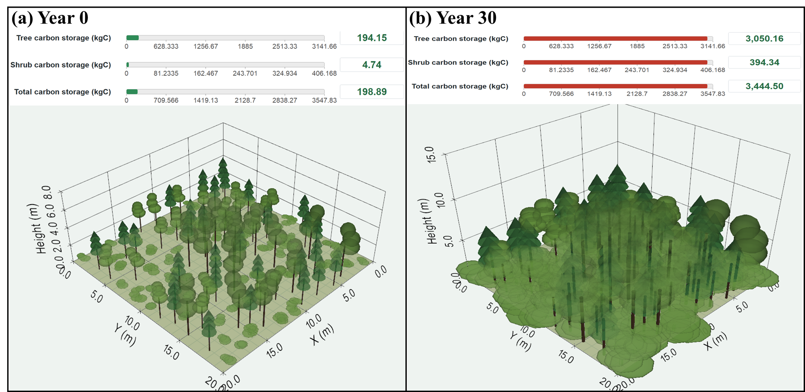
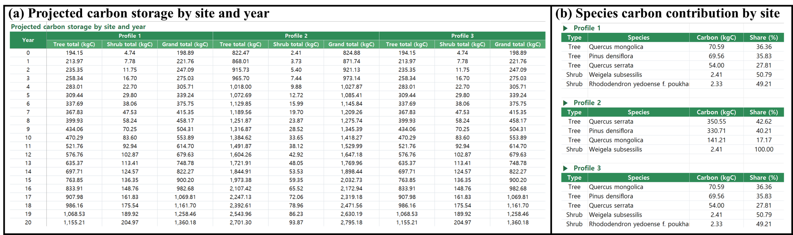

# FORECAST-SW

**산림복원지 탄소저장량 평가 및 성장 시나리오 분석 소프트웨어**

[English](README.en.md) · **한국어**

FORECAST-SW는 산림복원지의 교목·관목 혼합 인벤토리를 대상으로 살아 있는 식생의 바이오매스 탄소저장량을 평가하는 Windows용 오픈소스 데스크톱 프로그램이다. 상대생장식 관리, 단위 일관성을 유지하는 계산, 대상지 간 비교, **30년 범위의 결정론적 성장 시나리오**, 3D 시각화, XLSX 보고 기능을 통합한다.

이 문서는 FORECAST-SW v1.0과 함께 제공되는 논문 원고를 기준으로 작성했다. 그림 번호와 표 1–3은 논문과 일치하며, 설치·빌드·저장소 사용 안내도 함께 제공한다.

#### 코드 메타데이터 (Code metadata)

| Nr | 항목 | 내용 |
|:---:|---|---|
| C1 | 현재 코드 버전 | FORECAST-SW v1.0 |
| C2 | 코드 저장소 영구 링크 | [FORECAST-SW 저장소](https://github.com/ISW-LAB/FORECAST-SW) |
| C3 | 재현 캡슐 영구 링크 | 해당 없음 |
| C4 | 코드 라이선스 | [MIT](LICENSE); `species_data.json` 은 [공공누리 제1유형](DATA_LICENSE.md) |
| C5 | 버전 관리 시스템 | Git |
| C6 | 사용 언어·도구·서비스 | Python, PyQt5, NumPy, Matplotlib, openpyxl, Pillow, PyVista/VTK, PyInstaller, Inno Setup |
| C7 | 컴파일 요구사항·OS·의존성 | Windows 10/11; Python ≥ 3.10; [`requirements.txt`](requirements.txt) 참조 |
| C8 | 개발자 문서·매뉴얼 | English: [README.en.md](README.en.md); Korean: [README.ko.md](README.ko.md) |
| C9 | 문의 이메일 | [kc.jeong-isw@cbnu.ac.kr](mailto:kc.jeong-isw@cbnu.ac.kr); [gc.jo-isw@cbnu.ac.kr](mailto:gc.jo-isw@cbnu.ac.kr) |

[1. 구조](#1-구조와-워크플로) · [2. 상대생장식 라이브러리](#2-상대생장식-라이브러리) · [3. 계산](#3-계산) · [4. 적용 예시](#4-적용-예시) · [5. 설치](#5-설치와-실행) · [6. 편집·배포](#6-상대생장식-편집과-배포) · [7. 빌드](#7-빌드) · [8. 테스트](#8-테스트) · [9. 구조](#9-저장소-구조) · [10. 인용](#10-인용) · [11. 라이선스](#11-라이선스)

> [!IMPORTANT]
> **적용 범위.** 상대생장식은 직경–바이오매스 관계를 정의하고, 직경 발달은 연간 생장량으로 따로 지정한다. 따라서 궤적은 **지정된 생장 가정 하의 결정론적 산출**이며 검증된 예측이 아니다. 적합 직경범위를 벗어난 값은 **외삽**이다. 시나리오는 투영 기간 동안 모든 식재 개체가 생존한다고 가정한다. 식재면적 기준값과 3D 형상은 소프트웨어 설정값이며 생태적 수용력, 적정 식재밀도, 실측 수관 구조를 나타내지 않는다. 선택한 식의 반응변수·바이오매스 구성요소·예측변수 단위·측정 방법이 평가 목적에 맞는지 확인해야 한다.

---

## 1. 구조와 워크플로

Windows용 Python + PyQt5 구현. NumPy(계산), Matplotlib(2D 그래프), openpyxl(XLSX), PyVista/VTK(선택적 3D). 한국어·영어 인터페이스는 동일한 계산 서비스를 사용하며, 패키징된 프로그램은 별도 Python 설치 없이 실행된다.

<p align="center">
  
</p>

> **Figure 1.** 상대생장식 라이브러리 관리에서 탄소저장량 평가, 시나리오 분석, 보고까지 이어지는 FORECAST-SW의 소프트웨어 구조와 8단계 워크플로.

| 단계 | 담당 | 핵심 내용 |
|:---:|---|---|
| **1** | Library Manager | 4개 컬렉션에 식과 파라미터 정의 — 계수, 탄소계수, 적합범위, 기간별 생장량 3개(1–10 / 11–20 / 21–30년) |
| **2** | Library Manager | 식별자·중복·계수값·범위 순서·수식 검증 → JSON 저장 |
| **3** | Library Manager | 시작 시 검증된 사용자 라이브러리 로드, 기본 라이브러리는 폴백으로 유지 |
| **4** | Assessment App | 대상지 정보와 수종·직경·대표개체수 입력. DBH·RCD를 cm로 입력해 식의 원 단위로 변환하며, 레코드 단위 재정의 가능 |
| **5** | Assessment App | 입력·계산 2단계 검증 + 식재면적 안전장치 |
| **6** | Assessment App | 공통 엔진이 레코드별 평가 → 수종·대상지 집계 → 탄소밀도 산출 |
| **7** | Assessment App | 저장된 생장량으로 0–30년 시나리오 투영, 현재 저장량과 **동일한 엔진**으로 평가 |
| **8** | Assessment App | 2D 그래프, 선택적 3D 뷰, 대상지 비교, XLSX 내보내기 |

---

## 2. 상대생장식 라이브러리

**77개 레코드 · 학명 67종.** 교목·관목의 핵심 컬렉션에는 연구진이 국내 산림복원지에서 바이오매스를 직접 측정해 개발한 식 22개가 포함된다. 국내·국외 확장 컬렉션의 식 55개는 기존 문헌에서 수집한 것이다. 원 연구의 지역·임분 조건·바이오매스 구성요소가 다르면 같은 수종이라도 레코드를 분리해 보존한다 — 예: *Pinus thunbergii*(곰솔)는 **4개 레코드**.

77개 레코드 전부를 대상지 평가 화면에서 선택할 수 있다. 각 레코드는 **예측변수**를 기준으로 교목/관목 입력 탭에 배치된다 — 변수가 RCD 인 레코드는 관목, 그 외는 교목이며 결과적으로 **교목 59개 · 관목 18개**다.

| 컬렉션 | 레코드 | 예측변수 | 저장 형식 | 대상지 평가 | 그래프 기준 |
|---|---:|---|---|:---:|:---:|
| 교목 `TREE_BASE` | **7** | DBH (cm) | 계수 `a, b, CF` + 범위 + 생장량 | ✅ | 연도별 · 직경별 |
| 관목 `SHRUB_SPECIES` | **15** | RCD (mm 적합) | 계수 `a, b, CF` + 범위 + 생장량 | ✅ | 연도별 · 직경별 |
| 국내 `DOMESTIC_SPECIES` | **30** | DBH · RCD (+ 수고·밀도) | 수식 문자열 + 범위 | ✅ | 직경별 |
| 국외 `FOREIGN_SPECIES` | **25** | DBH · RCD · 수고 (+ 수고·LAI·길이) | 수식 문자열 + 범위 | ✅ | 직경별 |
| **합계** | **77** | | | **77** | **직경별 77 · 연도별 22** |

#### 표 1. FORECAST-SW 교목·관목 컬렉션의 대표 상대생장식 레코드 — 예측변수 정의, 적합 직경범위, 기간별 생장량

| 학명 | 상대생장식 | 예측변수 | 적합범위 | 1–10 | 11–20 | 21–30 | Reference |
|---|---|:---:|:---:|---:|---:|---:|---|
| ***교목 컬렉션*** | | | | | | | |
| *Pinus densiflora* | `Y = 0.0737·X^2.5735` | DBH | 1–15 cm | 0.11 | 0.20 | 0.70 | [23](#ref-23), [24](#ref-24) |
| *Pinus thunbergii* | `Y = 0.0679·X^2.5770` | DBH | 1–29 cm | 0.24 | 0.32 | 0.32 | [23](#ref-23), [25](#ref-25) |
| *Chamaecyparis obtusa* | `Y = 0.3617·X^2.0450` | DBH | 1–50 cm | 0.11 | 0.23 | 0.23 | [23](#ref-23), [25](#ref-25) |
| *Quercus serrata* | `Y = 0.2002·X^2.3767` | DBH | 1–30 cm | 0.13 | 0.30 | 0.30 | [23](#ref-23), [25](#ref-25) |
| *Quercus mongolica* | `Y = 0.0147·X^3.1075` | DBH | 6–30 cm | 0.40 | 0.40 | 0.40 | [24](#ref-24), [25](#ref-25) |
| ***관목 컬렉션*** | | | | | | | |
| *Euonymus japonicus* | `Y = 0.0002·(10X)^2.5` | RCD | 0.6–5.3 cm | 0.30 | 0.22 | 0.22 | [26](#ref-26) |
| *Rhododendron yedoense* | `Y = 0.0003·(10X)^2.4` | RCD | 0.1–2.2 cm | 0.31 | 0.17 | 0.17 | [26](#ref-26) |
| *Euonymus alatus* | `Y = 0.000022·(10X)^2.55` | RCD | 1.1–6.7 cm | 0.38 | 0.25 | 0.25 | [26](#ref-26) |
| *Lespedeza bicolor* | `Y = 0.00015·(10X)^2.8` | RCD | 0.2–1.7 cm | 0.10 | 0.06 | 0.06 | [23](#ref-23) |
| *Weigela subsessilis* | `Y = 0.00029·(10X)^2.4` | RCD | 0.6–3.9 cm | 0.30 | 0.24 | 0.24 | [27](#ref-27) |

Reference 열은 논문과 동일하게 지원 보고서 및 수식 데이터베이스에 제시된 상대생장식의 출처를 표시한다. 서지정보는 [상대생장식 출처](#상대생장식-출처)에 정리했다. 생장량은 별도로 설정하는 파라미터이며, 참고문헌 연결은 논문의 상대생장식 출처 표기를 따른다.

- 1–10, 11–20, 21–30 열은 각 기간의 연간 직경 생장량(cm yr⁻¹). **0 = 해당 기간에 직경 생장을 두지 않음.**
- `X` 는 교목 DBH, 관목 RCD (cm). mm로 적합된 관목식은 **`10X`** 로 쓰고 적합 한계를 cm로 환산 — 원 관계식을 재적합 없이 보존한다.
- **수종마다 대상지 3종의 레코드를 각각 보유**하며, 프로그램은 선택된 대상지의 레코드 하나만 적용한다 — 대상지 공통 '기본식' 개념은 없다 (`SiteCategoryTests`). 네 컬렉션 모두 같은 `by_env` 구조를 쓴다.
- 출처가 실제로 구분하는 수종은 값이 다르다: *Pinus densiflora*(소나무)는 시트 순번 1 / 2 / 3 을 세 대상지에 각각 쓴다. 나머지 수종은 세 대상지가 같은 값으로 초기화되어 있고, 근거가 확보되는 대로 Manager 에서 나누어 넣을 수 있다.
- **연 직경 생장량 보정계수**가 선택된 레코드의 성장량에 추가로 곱해진다. 대상지 × 생장형 단위이며 기본값은 `1.0`(보정 없음), 수종별 예외를 입력하면 그 값이 우선한다. 30년 시나리오만 조정하고 식은 그대로이므로 0년차 저장량은 변하지 않는다.
- 전체 목록: [`species_data.json`](species_data.json).

#### 그래프 기준

추정 패널은 탭마다 x축 기준을 선택해 탄소저장량을 표현한다:

- **연도별** — 핵심 교목·관목 **22개 레코드**의 기간별 직경 생장량을 적용한 0–30년 결정론적 시나리오다. 국내·국외 55개 레코드는 생장량이 저장되어 있지 않아 논문에서 다루는 결정론적 성장 시나리오 분석에서 제외된다.
- **직경별** — 예측변수 축에 대한 탄소저장량으로 **77개 전체**를 지원한다. 각 곡선은 해당 레코드의 적합범위를 훑고, 출처가 정의역을 주지 않은 **20개** 레코드는 입력값 주변 구간만 그린 뒤 그 사실을 표시한다. 레코드마다 정의역이 달라 이 기준에서는 합계 곡선을 제공하지 않는다.

확장 컬렉션 레코드도 대상지 합계, 식재면적 검증(개체당 면적은 수종별이 아니라 생장형별로 정의됨), Excel 내보내기에 포함된다. 결과 표 아래에는 핵심/확장 소계를 따로 표시해 22개 레코드 기준 수치를 그대로 확인할 수 있다. 논문의 3D 성장 예시는 핵심 컬렉션의 연도별 시나리오와 동일한 직경 생장량을 사용한다.

---

## 3. 계산

```
B_i(t)    = a_i · [ q_i · D_i(t) ]^b_i
C_i(t)    = B_i(t) · CF_i · n_i                                        … Eq. (1)
C_site(t) = Σ C_i(t)        i ∈ V (검증을 통과한 레코드)

A_required = 1.00 · Σ n_i(교목) + 0.25 · Σ n_i(관목)                     … Eq. (2)
             → A_required > A_site 이면 계산 중단

ρ_C(t) = C_site(t) / A_site                                            … Eq. (3)

D_i(t) = D_i(0) + Σ_{s=1..t} g_i,p(s)                                  … Eq. (4)
         p(s) = 1 (1–10년) · 2 (11–20년) · 3 (21–30년)

v_i(t) = D_min,i ≤ D_i(t) ≤ D_max,i 이면 1, 아니면 0                     … Eq. (5)
```

| 기호 | 의미 |
|---|---|
| `D_i(t)` | t년차 DBH 또는 RCD **(cm)**. 현재 저장량은 `t = 0` |
| `q_i` | 예측변수 스케일링 — cm 기준 교목식 `1`, mm 기준 관목식 `10` |
| `n_i`, `CF_i` | 대표 개체수; 레코드별 탄소계수(재정의값 반영) |
| `v_i(t) = 0` | 사후 감사 표시 — **외삽**으로 얻은 추정치 |

- Eq. (1)은 레코드를 **개별 합산**하므로 멱함수의 비선형성이 대상지 총량에 보존된다.
- `q_i` 는 식 레코드의 속성이라 재정의(`a_i`, `b_i`, `CF_i`)로 바뀌지 않는다.
- Eq. (3): 총 저장량은 **대상지 면적과 무관**, 탄소밀도만 면적에 **반비례**.
- Eq. (5)는 계산 **이후**에 수행되며 외삽 여부만 표시할 뿐 궤적을 바꾸지 않는다.
- 국내·국외 레코드는 `Y_i = f_i(X_i, H_i)` 형태로 AST 허용목록을 통해 평가한다(Python `eval` 미사용). 탄소계수·생장량을 저장하지 않으므로 **고정 CF₀ = 0.5** 를 적용한다. 논문에서 다루는 결정론적 성장 시나리오 분석에서는 제외되며, 직경별 그래프는 제공한다.

---

## 4. 적용 예시

아래 예시는 **시험 설정에서의 소프트웨어 동작**을 보이기 위한 것이며, 독립적인 현장 관측과의 일치를 보인 것이 아니다.

### 4.1 상대생장식 라이브러리 구성과 배포

<p align="center">
  
</p>

> **Figure 2.** 레코드 구성, 파라미터 편집, 검증된 라이브러리 배포를 포함한 FORECAST-SW의 상대생장식 라이브러리 관리.

Manager는 4개 컬렉션의 레코드를 관리한다. Figure 2의 화면은 복원 대상지 유형별 탭과 교목·관목 하위 탭으로 구성되며, 계수·탄소계수·적합 한계·기간별 생장량을 각각의 열에서 편집할 수 있다.

**(a)** 레코드 추가 · **(b)** 레코드 삭제 · **(c)** 회귀계수 수정 · **(d)** 검증된 JSON 배포 — 프로그램 재빌드 또는 기존 설치본에 적용.

### 4.2 교목·관목 혼합 인벤토리의 통합 평가

<p align="center">
  
</p>

> **Figure 3.** 교목·관목 혼합 인벤토리 평가, 상대생장식 확인, 탄소저장량 분석, 3D 시각화를 포함한 프로파일 1의 통합 평가 워크플로.

프로파일 1 — 20 m × 20 m 대상지에 교목 3종·관목 2종.

그림 상단은 인벤토리 입력과 선택한 시나리오 연도의 교목·관목·총 탄소저장량을 보여주는 주 작업화면이다. 아래 패널은 **(a)** 선택된 식·계수·탄소계수·적합범위·생장량을 확인하는 교목·관목 입력 창, **(b)** 0–30년 탄소저장량 궤적과 수종별 기여도, **(c)** 3D 임분 시각화를 보여준다. 공통 연도 바는 0–30년 범위에서 시나리오 화면을 함께 갱신한다.

### 4.3 면적을 고려한 대상지 간 비교

**인벤토리 구성**에 따른 변동과 **면적 정규화**로 생기는 변동을 분리하도록 설계했다.

#### 표 2. Figure 4의 대상지 간 비교에 사용한 통제 인벤토리와 산출값

| 비교 | 프로파일 | 대상지 면적 (m²) | 교목 레코드 | 관목 레코드 | 저장량 (kg C) | 밀도 (kg C m⁻²) |
|---|:---:|:---:|---|---|---:|---:|
| **(1) 공통 면적** | 1 | 400 | *P. densiflora* 5.0 × 30;<br>*Q. serrata* 4.0 × 20;<br>*Q. mongolica* 8.0 × 15 | *R. yedoense* f. *poukhanense* 1.2 × 40;<br>*W. subsessilis* 1.5 × 25 | 198.89 | 0.4972 |
| | 2 | 400 | *P. densiflora* 7.0 × 60;<br>*Q. serrata* 8.0 × 25;<br>*Q. mongolica* 10.0 × 15 | *W. subsessilis* 1.5 × 25 | **824.88** | 2.0622 |
| | 3 | 400 | *Q. serrata* 4.0 × 20;<br>*Q. mongolica* 6.0 × 10 | *R. yedoense* f. *poukhanense* 1.8 × 120;<br>*W. subsessilis* 2.0 × 90 | **109.08** | 0.2727 |
| **(2) 공통 인벤토리** | 1 | 400 | *P. densiflora* 5.0 × 30;<br>*Q. serrata* 4.0 × 20;<br>*Q. mongolica* 8.0 × 15 | *R. yedoense* f. *poukhanense* 1.2 × 40;<br>*W. subsessilis* 1.5 × 25 | 198.89 | **0.4972** |
| | 2 | 500 | *(동일)* | *(동일)* | 198.89 | **0.3978** |
| | 3 | 600 | *(동일)* | *(동일)* | 198.89 | **0.3315** |

<sub>직경은 교목 DBH, 관목 RCD (cm). 직경 뒤의 곱셈 기호는 대표 개체수이며, 프로파일 번호는 각 비교 안에서 매겼다.</sub>

<p align="center">
  
</p>

> **Figure 4.** 공통 면적의 세 인벤토리와 면적만 달리한 동일 인벤토리를 사용한, 총 탄소저장량과 면적 정규화 탄소밀도의 대상지 간 비교.

- **(a) 공통 면적** — 면적을 400 m²로 고정해 인벤토리 구성만 분리: 세 인벤토리의 총량 **109.08 → 824.88 kg C**. 수종 구성·초기 직경·대표 개체수 차이를 반영한다.
- **(b) 공통 인벤토리** — 프로파일 1을 400 / 500 / 600 m²에 적용해 면적만 분리: 총량은 **198.89 kg C 불변**, 밀도만 **0.4972 → 0.3978 → 0.3315 kg C m⁻²** 로 감소.

### 4.4 결정론적 성장 시나리오

<p align="center">
  
</p>

지정된 직경 생장량이 시간에 따른 탄소저장량 변화로 이어지는 과정을 보여준다. 프로파일 1의 총 탄소저장량은 **0년차 198.89 kg C**에서 **30년차 3,444.50 kg C**로 증가한다.

> **Figure 5.** **(a) 0년차**와 **(b) 30년차**의 교목·관목·총 탄소저장량 및 해당 3D 임분 시각화를 보여주는 프로파일 1의 결정론적 성장 시나리오.

| 연차 | 교목 (kg C) | 관목 (kg C) | **총계 (kg C)** |
|:---:|---:|---:|---:|
| 0 | 194.15 | 4.74 | **198.89** |
| 30 | 3,050.16 | 394.34 | **3,444.50** |

30년차 값에는 투영 직경이 적합범위를 벗어난 **외삽 추정치**가 포함될 수 있다. 3D 뷰는 소프트웨어가 정의한 시나리오 형상이며 실측 수관 구조가 아니다.

### 4.5 2단계 레코드 검증과 식재면적 안전장치

#### 표 3. 직경범위 검증과 식재면적 안전장치의 시험 사례 및 결과

| 검사 | 시험 사례 | 기준 | 결과 |
|---|---|---|---|
| ***(a) 직경범위 검증*** | | | |
| 교목 입력 | *P. densiflora*, DBH = 20 cm | 적합범위 1–15 cm | **거부** |
| 관목 입력 | *W. subsessilis*, RCD = 5.0 cm | 적합범위 0.6–3.9 cm | **거부** |
| 경계값 | DBH = 1.00 또는 15.00 cm | 경계 포함 | **허용** |
| 경계 밖 | DBH = 0.99 또는 15.01 cm | 적합범위 밖 | **거부** |
| 계산 단계 | 입력 검증을 우회한 범위 밖 레코드 | 적합범위 재검사 | **계산 전 제외** |
| ***(b) 식재면적 안전장치 (A_site = 100 m²)*** | | | |
| 면적 초과 | `A_required = 105.00 m²` | `A_required > A_site` | **계산 중단** |
| 면적 경계 | `A_required = 100.00 m²` | `A_required = A_site` | **허용** |

적합범위를 벗어난 값은 거부하고 경계값은 허용했으며, 입력 검증을 우회한 레코드는 계산 단계에서 제외했다. 면적 안전장치는 요구 면적이 대상지 면적을 **초과할 때만** 계산을 중단했다.

### 4.6 결과 보고

<p align="center">
  
</p>

> **Figure 6.** 대상지 단위 탄소저장량 추정과 수종별 탄소 기여도를 보여주는 FORECAST-SW의 XLSX 출력 예시.

**(a)** 시나리오 기간 전체에 걸친 프로파일별 연차 교목·관목·총 저장량 · **(b)** 수종별 저장량과 상대 기여도. 추가 워크시트에 대상지 비교 결과와 해당 그림이 저장된다.

---

## 5. 설치와 실행

| 실행 파일 | 역할 |
|---|---|
| `FORECAST-SW.exe` | **Assessment Application** — 대상지 평가·비교·시나리오 |
| `FORECAST-SW-Equation-Library-Manager.exe` | **Equation Library Manager** — 상대생장식 편집·검증·배포 |

`FORECAST-SW_Setup_1.0.exe` 로 두 프로그램이 함께 설치된다(Python 불필요). 소스 실행:

```powershell
pip install -r requirements.txt
python main.py              # 언어 선택창
python main.py --lang ko    # 한국어
python main.py --lang en    # 영어
```

---

## 6. 상대생장식 편집과 배포

Manager는 `species_data.json` 을 편집 가능한 표로 연다(Figure 2). 저장 전 검증과 `.bak` 자동 백업을 지원하며, 핵심 소스 전체를 번들하므로 단독 실행된다.

표는 대상지 유형으로 구성된다 — **대상지당 1개 탭**(산불피해지 자연복원 / 산불피해지 인공복원 / 채석장 인공복원)이며 각 탭은 **교목·관목** 하위 탭으로 나뉜다:

- 각 표는 그 생장형의 **전체 레코드**(교목 59개 · 관목 18개)을 보여준다. 계수 열(`a, b, CF`·범위·성장률)과 식 열(상대생장식·범위·변수)을 하나의 표로 합쳤고, 행에 해당하지 않는 열은 비어 있으며 수정할 수 없다. **구분** 열이 각 행을 핵심·국내·국외로 표시한다.
- 값은 대상지별로 편집한다 — 같은 수종을 세 탭에서 각각 독립적으로 조정한다.
- 수종 추가·삭제는 세 대상지에 동시에 적용되므로, 모든 수종은 항상 대상지당 정확히 1개 레코드를 갖는다.
- **성장률 보정계수** 입력은 각 대상지 탭 상단에 교목·관목 각 1개씩 있고(기본값 `1.0`), 그 대상지의 성장률에 곱해진다.

| 방식 | 내용 | Python 필요 |
|---|---|:---:|
| **exe 재빌드** | 새 `species_data.json` 으로 `FORECAST-SW.exe` 재빌드 | 3.10+ |
| **JSON 적용** | 기존 `FORECAST-SW.exe` 옆에 `species_data.json` 복사 | 불필요 |

> 새 수종을 추가할 때는 학명 열도 채워야 영문 모드에서 학명으로 표기된다.

UI 문구도 같은 방식이다: [`translations_ko_en.json`](translations_ko_en.json) 이 화면에 쓰이는 모든 한글 원문 → 영문 대응표를 담고 있다. 영문 값을 수정하고 재시작하면 바로 반영되며(재빌드 불필요), 배포된 `FORECAST-SW.exe` 옆에 수정한 파일을 두면 동일하게 적용된다.

---

## 7. 빌드

```powershell
python build_exe.py                  # onefile (기본) · --onedir · --debug
python build_exe.py --clean-cache    # build/, dist/ 삭제 후 빌드
python build_exe.py --rebuild-venv   # 빌드 전용 venv 강제 재생성
python build_updater.py              # Equation Library Manager (또는 build_library_manager.bat)
```

`pyinstaller` 를 따로 설치할 필요는 없다 — 스크립트가 전용 venv(`~\.carboncalc_build_venv`)를 자동 생성하며 최초 1회만 몇 분 걸린다. `species_data.json` 은 자동 동봉된다.

**설치 마법사(선택):** `build_exe.py --onedir` → `build_updater.py` → [Inno Setup 6](https://jrsoftware.org/isdl.php) 으로 `installer.iss` 컴파일 → `installer_output\FORECAST-SW_Setup_1.0.exe`.

---

## 8. 테스트

```powershell
python -m unittest discover -s tests -v
```

회귀검사 22건이 표 2–3와 Figure 4–5의 값을 그대로 재현한다 — 라이브러리 레코드 수, 면적 정규화 밀도(`0.4972 / 0.3978 / 0.3315`), 개체수 비례성, 직경 경계값, 시나리오 반복성 및 0년 일치, 관목 mm↔cm 등가성, 호환 수식 55개 전체 실행, 위험 문법 차단. 동일 검사가 Windows · Python 3.10/3.11 CI에서 실행된다. 빌드 환경과 체크섬: [BUILD_VERIFICATION.md](BUILD_VERIFICATION.md).

---

## 9. 저장소 구조

```
├── main.py                        ← 실행 진입점
├── species_data.json              ← 상대생장식 라이브러리 (77개 레코드) — 표 1
├── translations_ko_en.json        ← UI 한글→영문 번역표 (JSON 재정의, 재빌드 불필요)
├── build_exe.py / build_updater.py / build_library_manager.bat
├── updater_app.py                 ← Equation Library Manager — Figure 2, 1–3단계
├── installer.iss                  ← Inno Setup 설치 마법사 스크립트
├── carbon_calculator/
│   ├── calculations.py                탄소저장량 계산 엔진 — Eq. (1), (3), 6단계
│   ├── input_limits.py                식재면적 안전장치 — Eq. (2), 5단계
│   ├── equation_eval.py               수식 평가 (AST 허용목록)
│   ├── data.py / data2.py             계수·상대생장식 (JSON 로드 실패 시 폴백)
│   ├── species_library.py             77개 레코드 통합 계층 (생장형 분류·그래프 기준)
│   ├── main_window.py                 대상지 평가 화면 — Figure 3, 4–7단계
│   ├── combined_window.py             통합 윈도우, 대상지별 탭 — Figure 4
│   ├── tree_simulation/               3D 성장 시각화 — Figure 5
│   ├── excel_export.py                XLSX 내보내기 — Figure 6, 8단계
│   ├── main_window2.py                국내·국외 화면 (v1.0 미노출)
│   ├── plotting.py / widgets.py / i18n.py / translations.py
│   └── theme.py / font_config.py / ui_scale.py
├── tests/test_core.py             ← 회귀검사 22건 — 표 2–3
└── figures/paper/                 ← 첨부 논문 원고의 Figure 1–6
```

**문제 해결** — PyQt5 없음: `pip install -r requirements.txt` · PyInstaller 빌드 오류: `--rebuild-venv` · exe 실행 직후 종료: `--debug` 로 재빌드 후 콘솔 확인 · 한글 깨짐: "맑은 고딕" 설치 확인 · 글자 크기: `carbon_calculator\font_config.py` 의 `FONT_SIZE_DELTA` 조정.

---

## 10. 인용

> Jeong, K., Jo, G., Kim, J., Kim, H.-K., Kim, C.-B., Park, K. H., Im, S., & Lee, E.
> *FORECAST-SW: Carbon-stock assessment and growth scenario analysis for forest restoration plantings.* Accompanying manuscript.

기계가독 메타데이터: [`CITATION.cff`](CITATION.cff). **개별 상대생장식을 사용할 때는 해당 식의 원 출처 문헌도 함께 인용해야 한다.**

### 상대생장식 출처

참고문헌 번호는 논문의 표 1 및 참고문헌 목록과 동일하다. 기관명과 제목은 논문의 영문 서지정보를 따른다.

- <a id="ref-23"></a>**[23]** National Institute of Forest Science (2024). *Development of allometric equations for young trees.* Contract research report.
- <a id="ref-24"></a>**[24]** National Institute of Forest Science (2023). *Biomass measurement and development of allometric equations for oaks in forest restoration sites.* Research report.
- <a id="ref-25"></a>**[25]** Korea Forest Research Institute (2014). *Carbon emission factors and biomass allometric equations for major tree species in Korea.* Research report.
- <a id="ref-26"></a>**[26]** Korea Arboreta and Gardens Institute (2022). *Establishing a foundation for enhancing urban biodiversity.* Research report.
- <a id="ref-27"></a>**[27]** Korea Arboreta and Gardens Institute (2023). *Research on enhancing biodiversity in urban forests.* Research report.

**문의**: [kc.jeong-isw@cbnu.ac.kr](mailto:kc.jeong-isw@cbnu.ac.kr) · [gc.jo-isw@cbnu.ac.kr](mailto:gc.jo-isw@cbnu.ac.kr)

---

## 11. 라이선스

| 대상 | 라이선스 |
|---|---|
| 소스 코드, 빌드 스크립트, 문서, 저장소 그림 | [MIT License](LICENSE) |
| `species_data.json` 의 과학 수식 라이브러리 | [공공누리 제1유형(출처표시)](DATA_LICENSE.md) |

개별 상대생장식은 원 출처 문헌의 서지정보도 함께 유지해야 한다 — [DATA_LICENSE.md](DATA_LICENSE.md) 참조.

---

<sub>본 연구는 농림축산식품부 IPET(RS-2024-00398561), 과학기술정보통신부 IITP(IITP-2026-RS-2020-II201462), 교육부 NRF(RS-2025-25430681), 국립산림과학원 NIFoS(FE0100-2022-01-2026)의 지원으로 수행되었다.</sub>
